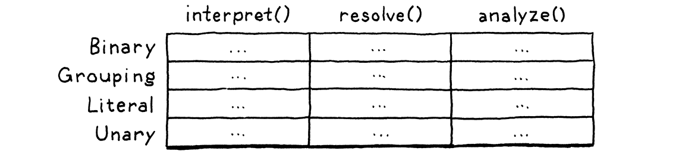
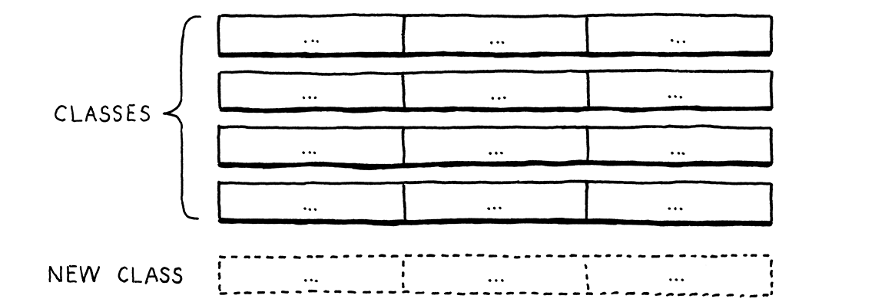
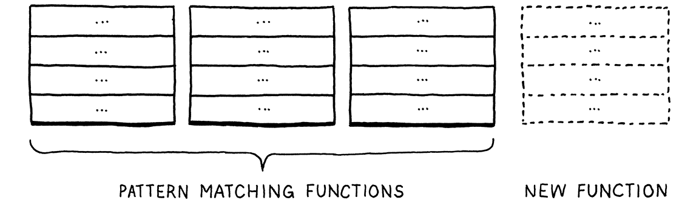

# Notes on _Crafting Interpreters_

## Programming languages that change how you think

It's well known that programming languages can change how you think about
computation. I am making a list of those I would like to explore, as well as
_how_ each one changes how you think, with lots of help from Claude:

- Lisp
  - Homoiconicity (code is data, data is code).
  - Macros (metaprogramming) for language extension.
- Haskell
  - Pure functions, types as propositions, effects as types.
  - Once you understand monads, you'll see their patterns everywhere: in Promise
    chains in JavaScript, Optional types in Java, error handling in Rust, etc.
- APL (and its modern descendants like J and K)
  - Instead of thinking in loops and iterations, you think in whole-array
    operations. The dense symbolic notation forces your brain to chunk
    operations at a higher level.
  - Fundamentally changes how you think about data manipulation.
- Prolog
  - Declarative logic programming where you specify what you want rather than
    how to get it.
  - You're describing a solution space rather than writing space.
- Curry
  - Combines Haskell's pure functional style with Prolog's logic programming.
  - You leave parts of your program unspecified and let the language search for
    solutions (!).
- Forth
  - Extremely minimal, stack-based.
  - Forces you to think about program flow in terms of data stack manipulation.
  - You extend the language to match your problem rather than working within
    existing abstractions.
- Smalltalk
  - Everything is an object.
  - The purer grandfather of OOP: gives deeper insights into message-passing and
    object composition.
  - Image-based development environment also changes how you think about
    programming environments.
- Rust
  - Ownership system forces you to rethink data lifetime and sharing.
- Factor
  - Modern concatenative language like Forth but with modern conveniences.
  - Programming by function composition takes on a whole new meaning when
    everything is stack manipulation.
- Erlang
  - Forces you to think in terms of isolated processes and message passing.
  - Its "let it crash" philosophy and supervisor trees offer a radically
    different approach to reliability.

## Project objectives

These are the Lox programs to aim for:

- For, while, if/else, arithmetic, printing
- Multiple handwritten tests
- Function
- Reach: Luhn checksum
- Graph DFS, recursion
- Arrays

Resources on machine learning domain-specific languages from my advisor:

- Halide, EDSLs (Embedded DSLs). Check out conferences rather than papers:
ASPLOS, NeurIPS, PLDI, OOPSLA, conferences on fuctional programming languages.
ML languages are named differently from just "ML languages": check out languages
for accelerators/NLP/vision, domains
- The Triton language is worth checking out.
- Read Bril, on embedded DSLs, by Adrian Sampson. Check out all the practical
work done with EDSLs.
- The recommended text on programming languages is _Modern Compiler
Implementation_.
  - From digging online, it seems the book's ML version is canonical and the
Java and C versions are ports.

## Chapter 4: Scanning

### Lexemes

Each individually meaningfully "blob" of characters is a _lexeme_. For example,
in the line

```js
var language = "lox";
```

the lexemes are `var`, `language`, `=`, `"lox"` and `;`.

---

### Line information in tokens for error reporting

Tokens need to store information about the position of the lexeme in the source
code to display to the user when there's a syntax error. The straightforward way
to do this is to store the line the token appears on (this is what the book
does), and maybe also the column and the token's length.

But a more involved way to do this is to store just the token's offset from the
beginning of the source file to the beginning of the lexeme, and the lexeme's
length. The scanner needs to know these anyway, so it incurs no overhead in
computing them. Then, when an error needs to be reported, the interpreter counts
the number of newlines preceding that stored location. This is linear-time
search (though you could store a list of the newline positions, and
binary-search over them, making having log-runtime but additional linear
memory). This _sounds_ slow, but you only rarely report errors. The
zero-computational-overhead in storing location could win out, amortized.

---

### What the scanner does, in Nystromic vividness

> The core of the scanner is a loop. Starting at the first character of the
> source code, the scanner figures out what lexeme the character belongs to, and
> consumes it and any following characters that are part of that lexeme. When it
> reaches the end of that lexeme, it emits a token.
>
> Then it loops back and does it again, starting from the very next character in
> the source code. It keeps doing that, eating characters and occasionally, uh,
> excreting tokens, until it reaches the end of the input.

---

### Regex and lexical grammars

Regexing during the scanning process seems to have surprising theoretical CS
depth:

> The rules that determine how a particular language groups characters into
> lexemes are called its **lexical grammar**. In Lox, as in most programming
> languages, the rules of that grammar are simple enough for the language to be
> classified a [**regular
> language**](https://en.wikipedia.org/wiki/Regular_language). That’s the same
> “regular” as in regular expressions.
>
> It pains me to gloss over the theory so much, especially when it’s as
> interesting as I think the [Chomsky
> hierarchy](https://en.wikipedia.org/wiki/Chomsky_hierarchy) and [finite-state
> machines](https://en.wikipedia.org/wiki/Finite-state_machine) are. But the
> honest truth is other books cover this better than I could. [_Compilers:
> Principles, Techniques, and
> Tools_](https://en.wikipedia.org/wiki/Compilers:_Principles,_Techniques,_and_Tools)
> (universally known as “the dragon book”) is the canonical reference.

You can use tools like
[Lex](http://dinosaur.compilertools.net/lex/) or [Flex](https://github.com/westes/flex)
to get a complete scanner out of a handful of defined regexes.

I need to chase down these rabbit holes at some point.

---

### Peeking lookahead

An interesting design choice:

> I could have made `peek()` take a parameter for the number of characters ahead
> to look instead of defining two functions, but that would allow _arbitrarily_
> far lookahead. Providing these two functions makes it clearer to a reader of
> the code that our scanner looks ahead at most two characters.

---

### Newlines vs `;`

How Python handles newlines is interesting:

> [Python](https://docs.python.org/3.5/reference/lexical_analysis.html#implicit-line-joining) treats
> all newlines as significant unless an explicit backslash is used at the end of
> a line to continue it to the next line. However, newlines anywhere inside a
> pair of brackets (`()`, `[]`, or `{}`) are ignored. Idiomatic style strongly
> prefers the latter.

## Chapter 5: Representing Code

### The evolution of syntactical grammars

Quite funny:

> People have been trying to crystallize grammar all the way back to
> Pāṇini's _Ashtadhyayi_, which codified Sanskrit grammar a mere couple thousand
> years ago. Not much progress happened until John Backus and company needed a
> notation for specifying ALGOL 58 and came up with [**Backus-Naur
> form**](https://en.wikipedia.org/wiki/Backus%E2%80%93Naur_form) (**BNF**).

### The Visitor pattern: an introduction

Here's a simple demonstration of the Visitor pattern using the example of a zoo
and different animals. Imagine a bunch of `Animal` subclasses:

```python
class Lion(Animal):
    def roar(self):
        return "ROAR!"

    def feed(self):
        return "Feeding the lion some meat"

    def make_sound(self):
        return self.roar()

    # Later, if we need to add health check...
    def health_check(self):
        return "Checking lion's teeth and claws"

    # And if we need to add playtime...
    def play_time(self):
        return "Playing with lion using big ball"

class Elephant(Animal):
    def trumpet(self):
        return "PAWOO!"

    def feed(self):
        return "Feeding the elephant some leaves"

    def make_sound(self):
        return self.trumpet()

    def health_check(self):
        return "Checking elephant's trunk and tusks"

    def play_time(self):
        return "Playing with elephant using water spray"

class Monkey(Animal):
    def screech(self):
        return "OOH OOH AH AH!"

    def feed(self):
        return "Feeding the monkey some bananas"

    def make_sound(self):
        return self.screech()

    def health_check(self):
        return "Checking monkey's agility and reflexes"

    def play_time(self):
        return "Playing with monkey using rope swings"
```

Usage would look like:

```python
# Create animals
lion = Lion()
elephant = Elephant()
monkey = Monkey()

# Do operations
print(lion.feed())          # "Feeding the lion some meat"
print(elephant.feed())      # "Feeding the elephant some leaves"
print(monkey.make_sound())  # "OOH OOH AH AH!"
```

The problems with this approach:

- Every time you want to add a new operation (like health_check or play_time),
  you have to modify _every_ animal class. With 3 animals it's manageable, but
  with 20 animals it becomes a maintenance nightmare.
- Related behaviors are scattered across different classes. All feeding logic is
  split between `Lion`, `Elephant`, and `Monkey` classes instead of being
  centralized in one place.
  - If you have a bug in the feeding logic, you have to fix it in multiple
    places.
- The animal classes become bloated with many methods that aren't core to what
  an animal is. An animal naturally makes sounds, but feeding and health checks
  are really zookeeper operations being forced into the animal class.

Compare this to the Visitor pattern where adding a new operation just means
creating a new visitor class:

```python
# Base classes
class Animal:
    def accept(self, visitor):
        visitor.visit(self)

class AnimalVisitor:
    def visit(self, animal):
        # This will be overridden by specific visitors
        pass

# Some concrete animals
class Lion(Animal):
    def roar(self):
        return "ROAR!"

class Elephant(Animal):
    def trumpet(self):
        return "PAWOO!"

class Monkey(Animal):
    def screech(self):
        return "OOH OOH AH AH!"

# Some concrete visitors
class PlayTimeVisitor(AnimalVisitor):
    def visit(self, animal):
        if isinstance(animal, Lion):
            return "Playing with lion using big ball"
        elif isinstance(animal, Elephant):
            return "Playing with elephant using water spray"
        elif isinstance(animal, Monkey):
            return "Playing with monkey using rope swings"

class FeedingVisitor(AnimalVisitor):
    def visit(self, animal):
        if isinstance(animal, Lion):
            return "Feeding the lion some meat"
        elif isinstance(animal, Elephant):
            return "Feeding the elephant some leaves"
        elif isinstance(animal, Monkey):
            return "Feeding the monkey some bananas"

class SoundVisitor(AnimalVisitor):
    def visit(self, animal):
        if isinstance(animal, Lion):
            return animal.roar()
        elif isinstance(animal, Elephant):
            return animal.trumpet()
        elif isinstance(animal, Monkey):
            return animal.screech()
```

Usage would look like:

```python
lion = Lion()
elephant = Elephant()
monkey = Monkey()

feeding_visitor = FeedingVisitor()
print(feeding_visitor.visit(lion))  # "Feeding the lion some meat"
```

The Visitor pattern is great when:

- you expect to add _operations_, not new _classes_ (here, animals), and
- the operations aren't fundamental to the class itself (feeding, health checks,
  and playtime aren't fundamental to what an animal is; addition/concatentation
  and multiplication aren't fundamental to what a token is).

This makes the Visitor pattern a natural fit for interpreter design.

### The Visitor pattern for interpreter design

Let's start with how to represent code in memory using Abstract Syntax Trees
(ASTs):

```python
# This represents different kinds of expressions in the language
class Expr:
    pass

# A literal is a bare value like 123 or "abc"
class Literal(Expr):
    def __init__(self, value):
        self.value = value

# A binary is two things with an operator between them, like 1 + 2
class Binary(Expr):
    def __init__(self, left, operator, right):
        self.left = left          # The operand on the left
        self.operator = operator  # The operator
        self.right = right        # The operand on the right
```

So, to represent `1 + 2` in memory, one would write:

```python
expr = Binary(
    left = Literal(1),
    operator = "+",
    right = Literal(2)
)
```

Now that we can represent expressions like `1 + 2` in memory, we need a way to
do things with them -- like print or evaluate them. The naive way to do this is
to add methods to each expression class:

```python
class Expr:
    pass

class Literal(Expr):
    def __init__(self, value):
        self.value = value

    def print(self):
        return str(self.value)

    def evaluate(self):
        return self.value

class Binary(Expr):
    def __init__(self, left, operator, right):
        self.left = left
        self.operator = operator
        self.right = right

    def print(self):
        return f"({self.operator} {self.left.print()} {self.right.print()}"

    def evaluate(self):
        left_val = self.left.evaluate()
        right_val = self.right.evaluate()
        match self.operator:
            case "+":
                return left_val + right_val
            # ... other operators
```

Usage would look like:

```python
expr = Binary(Literal(1), "+", Literal(2))
print(expr.print())     # prints "(+ 1 2)"
print(expr.evaluate())  # prints "3"
```

The problem is that if we want to do something new with expressions, like type
checking or optimization, we have to add a new method to _every_ expressions
class. This gets messy fast:

- All the code for one operation is spread across many files -- to make a
  change, you need to revisit _all_ the files and hope you don't forget one.
- If you want to share code between similar operations, it's awkward.

Nystrom pictures this as a table:



Object-oriented languages like Java or Python make adding a new row easy:



Functional languages in the ML family make adding a new function easy through
"_pattern matching_--sort of a type-based switch on steroids":



No programming language style makes it easy to add _both_ rows and columns to
this table. This is called the expression problem because people first landed on
it when trying to figure out the best way to model expression syntax tree nodes
in a compiler. The Visitor pattern is a handy workaround for this problem.

Here is what printing and evaluation look like following the Visitor pattern:

```python
class Expr:
    pass

class Literal(Expr):
    def __init__(self, value):
        self.value = value

    def accept(self, visitor):
        return visitor.visit_literal(self)

class Binary(Expr):
    def __init__(self, left, operator, right):
        self.left = left
        self.operator = operator
        self.right = right

    def accept(self, visitor):
        return visitor.visit_binary(self)

class PrintingVisitor:
    def visit_literal(self, expr: Literal):
        return str(expr.value)

    def visit_binary(self, expr: Binary):
        return f"({expr.operator} {expr.left.accept(self)} {expr.right.accept(self)}"

class EvaluationVisitor:
    def visit_literal(self, expr: Literal):
        return expr.value

    def visit_binary(self, expr: Binary):
        left_val = expr.left.accept(self)
        right_val = right.left.accept(self)
        match expr.operator:
            case "+":
                return expr.left + expr.right
            # ... other operators
```

### Abstract base classes

We'd like to create a "contract" that forces every class which inherits from
`Expr` to implement the `accept` method, and every class which inherits from
`ExprVisitor` to implement the `visit_literal`, `visit_binary`, etc methods.

So, for example, if we forget to implement `accept` for the `Literal` class:

```python
from abc import ABC, abstractmethod  # ABC = Abstract Base Class

class Expr(ABC):
    # Marks a method as mandatory to be implemented by subclasses
    @abstractmethod
    def accept(self, visitor):
        pass

    # Regular method, not abstract: subclasses can override this if they want
    # to, but they don't have to
    def say_hello(self):
        print("Hello!")

# This will raise an error because Literal doesn't implement accept
class Literal(Expr):
    def __init__(self, value):
        self.value = value

# This is correct because it implements accept, even though it doesn't implement
# say_hello
class Binary(Expr):
    def __init__(self, left, operator, right):
        self.left = left
        self.operator = operator
        self.right = right

    def accept(self, visitor):
        return visitor.visit_binary(self)
```

If you tried to create a `Literal(123)`, Python would raise an error like

```zsh
TypeError: Can't instantiate abstract class Literal with abstract method accept
```

This helps catch errors early: if you forget to implement `accept` in any
expression class, Python will let you know right away instead of failing later
when you try to use the visitor pattern.

We can set up similar abstract methods for the base `ExprVisitor` class:

```python
class ExprVisitor(ABC):
    @abstractmethod
    def visit_literal(self, expr: 'Literal'):
        pass

    @abstractmethod
    def visit_binary(self, expr: 'Binary'):
        pass
```

### An intro to typing in Python

Let's start with the very basics of Python's typing system:

The simplest type hints aren't enforced during runtime. They're closer to
documentation notes than a real typing system:

```python
name: str = "Alice"
age: int = 30
height: float = 1.75
is_married: bool = True

def greet(name: str) > str:
    return f"Hello, {name}!"

names: List[str] = ["Alice", "Bob", "Charlie"]

ages: Dict[str, int] = {
    "Alice": 30,
    "Bob": 17,
    "Charlie": 60
}

# Any means "could be anything"
def process_data(data: Any) -> str:
    return str(data)

# These all work because data is Any
print(process_data(123.456))
print(process_data("Hello"))
print(process_data([1, 2, 3]))
```

Type variables are like placeholders for types:

```python
from typing import TypeVar

# The string passed to TypeVar must match the variable name, i.e., this won't
# work:
# Right = TypeVar("Wrong")
T = TypeVar('T')

def first_elem(lst: List[T]) -> T:
    return lst[0]

# Works with any type
first_elem([1, 2, 3])        # T becomes int
first_elem(["a", "b", "b"])  # T becomes str
```

`TypeVar`s, too, are not enforced at runtime by default in Python. They're
primarily used for static type checking tools like mypy, documentation, and IDE
autocomplete and error detection.

So, this usage will work:

```python
# This of course works: it follows the type hints
result1 = first_elem([1, 2, 3])

# This works too, though we're mixing types
result2 = first_elem([1, "hello", 3.14])

# Even this works, though it clearly violates the List[] type hint
result2 = first_elem(42)
```

This is why Python is said to have [gradual
typing](https://en.wikipedia.org/wiki/Gradual_typing) (a system supposedly
[invented](https://wphomes.soic.indiana.edu/jsiek/what-is-gradual-typing/) by
Jeremy Siek with Walid Taha): you can add type hints gradually and use tools to
check them, but the runtime behavior remains dynamic.

### Generics in Python

Generics let us create classes that work with different types:

```python
from typing import Generic, TypeVar

T = TypeVar('T')

class Container(Generic[T]):
    def __init__(self, item: T):
        self.item = item

    def get(self) -> T:
        return self.item

# Type-safe containers
int_container = Container[int](42)
str_container = Container[str]("hello")

# Type checker would warn about these
x: str = int_container.get()  # Error: int is not str
int_container.item = "wrong"  # Error: str is not int
```

You can also define multiple type variables, like `Generic[K, V]`:

```python
K = TypeVar('K')
V = TypeVar('V')

class Pair(Generic[K, V]):
    def __init__(self, key: K, value: V):
        self.key = key
        self.value = value

    def get_key(self) -> K:
        return self.key

    def get_value(self) -> V:
        return self.value

coord = Pair[str, Tuple[float, float]]("x", (23.5, 14.5))
```

The power of generics is that they let us write code that works with _any_ type
while maintaining type safety. In our Visitor pattern:

```python
R = TypeVar('R')

class ExprVisitor(Generic[R]):
    def visit_number(self, value: float) -> R:
        raise NotImplementedError

# A visitor that evaluates to numbers
class Evaluator(ExprVisitor[float]):
    def visit_number(self, value: float) -> float:
        return value

# A visitor that converts to strings
class Printer(ExprVisitor[str]):
    def visit_number(self, value: float) -> str:
        return str(value)

class Validator(ExprVisitor[bool]):
    def visit_number(self, value: float) -> bool:
        return True
```

An involved example that combines generics with abstract base classes:

```python
from abc import ABC, abstractmethod
from typing import TypeVar, Generic

R = TypeVar('R')

class Doubler(Generic[R], ABC):
    @abstractmethod
    def double(self, x: int) -> R:
        pass

class IntDoubler(Doubler[int]):
    def double(self, x: int) -> int:
        return x * 2

class StrDoubler(Doubler[str]):
    def double(self, x: int) -> str:
        return str(x) * 2
```

### Testing the AST generator

I ran into a subtle Hypothesis bug while testing my AST printer (this happens a
lot (maybe too much) -- I find myself debugging Hypothesis more often than my
implementation when a test is failing).

Specifically, I was failing the last `assert` in this function, which checks
that the number of left-parens should equal the number of right-parens in any
pretty-printed string:

```python
def test_printer_output_format(self, expr):
        """Test that printer output follows expected format."""
        printer = AstPrinter()
        result = printer.print(expr)

        # Basic structural checks
        assert isinstance(result, str)
        assert len(result) > 0

        # Check parentheses matching
        assert result.count("(") == result.count(")")
```

The offending expression:

```lisp
(- (group nil) (group )))
```

What's going on with that? Why is there a space after `group`? Is there a
problem with the `parenthesize` method? Is the Hypothesis strategy generating
expressions correctly?

Is this even worth bothering with? I tried to pretty-print

```python
expr = Binary(
        Grouping(Literal(None)),
        Token(TokenType.MINUS, "-", None, 1),
        Grouping(Literal(None)),
    )
```

and it gave me exactly what you'd expect:

```lisp
(- (group nil) (group nil))
```

Should I just change that last assert to

```python
        assert not result.contains("(") or result.endswith(")")
```

and call it a day?

Turned out that that Hypothesis is generating an extra right paren as a literal
and grouping it. So, `(group ))` is really `())`, i.e., the character `)` inside
a group! The (ugly) fix was to blacklist parens from the strategy for generating
literals, a la below. This way, Hypothesis won't try to include parens as
literals in the expressions it generates.

```python
@st.composite
def literals(draw) -> Any:
    """Generate valid literal values."""
    return draw(
        st.one_of(
            st.none(),
            st.booleans(),
            st.floats(allow_nan=False, allow_infinity=False),
            # min_size=1 ensures no empty strings.
            # Blacklisting parens ensures the LPAREN == RPAREN in the structural
            # check below doesn't mess up.
            st.text(
                min_size=1,
                alphabet=st.characters(
                    blacklist_characters={"(", ")"}, blacklist_categories=("Cs",)
                ),
            ),
        )
    )
```

## Chapter 6: Parsing Expressions

### Floating-point nuances

I need to check out [What Every Computer Scientist Should Know About
Floating-Point
Arithmetic](https://docs.oracle.com/cd/E19957-01/806-3568/ncg_goldberg.html) later.

### Grammar

The grammar used in the book is:

```zsh
expression -> equality
equality   -> comparison ( ( "!=" | "==" ) comparison )*
comparison -> term ( ( ">" | ">=" | "<" | "<=" ) term )*
term       -> factor ( ( "-" | "+" ) factor )*
factor     -> unary ( ( "/" | "*" ) unary )*
unary      -> ( "!" | "-" ) unary | primary
primary    -> NUMBER | STRING | "true" | "false" | "nil" | "(" expression ")"
```

To decode this:

- The arrow `->` means "is defined as" or "can be".
- `|` means "or".
- `*` means "zero or more times".
- Quoted strings like `"!="` are literal tokens
- UPPERCASE words are token types.

So,

```zsh
term -> factor ( ( "-" | "+" ) factor )*
```

means that a term starts with a factor, then optionally (because of `*`) has
either a minus or a plus followed by another factor repeated arbitrarily many
times. This rule would match `42`, `42 + 24`, `42 + 24 - 32 + 64 + 96`, etc.

As another example,

```zsh
primary -> NUMBER | STRING | "true" | "false" | "nil" | "(" expression ")"
```

means that a primary can be a number, a string, the word "true", the word
"false", the word "nil", or an expression in parentheses.

### Testing with Hypothesis

Property-based testing with Hypothesis is extremely cool. It's a port of
QuickCheck (written in Haskell) to Python. In essence: instead of racking his
brains for test cases, a developer spells out properties that should hold true
-- _hypotheses_ about his code. Hypothesis tries to falsify his assumptions.
It's no surprise that this testing method originated in Haskell, with its famous
type systems. Programming languages truly shape how programmers think.

Because Hypothesis tests _invariants_, it finds edge cases developers would not
have thought of. For example, somewhere in my code I was using Python's
`c.isdigit()` method to... well, test if `c` was a digit. Turns out, the
superscripted "²" is a digit, but `str("²")` does not work! This forced me to
rewrite the condition as `"0" <= c <= "9"`.

Besides, QuickCheck is a nerdsnipe for elegant test case generation strategies,
and shrinking algorithms to find minimal failing cases. Learning about
Hypothesis has motivated me to do three things:

- Learn Lean and Coq, to understand code with _formal guarantees_, the thing
  Hypothesis' randomized testing is trying to approximate.
- Read John Hughes' [QuickCheck Testing for Fun and
  Profit](https://citeseerx.ist.psu.edu/document?repid=rep1&type=pdf&doi=5ae25681ff881430797268c5787d7d9ee6cf542c)
  his [Experiences with QuickCheck](https://www.cs.tufts.edu/~nr/cs257/archive/john-hughes/quviq-testing.pdf).
- Learn about [fuzzing](https://en.wikipedia.org/wiki/Fuzzing) and how
  Hypothesis implements/could be extended to implement it.

### The importance of error handling in parsers

> Don’t underestimate how important [a parser's error handling] is! In modern
IDEs and editors, the parser is constantly reparsing code—often while the user
is still editing it—in order to syntax highlight and support things like
auto-complete. That means it will encounter code in incomplete, half-wrong
states all the time.
>
> ...
>
> The days of needing to optimize your parser so that it could get through an
> entire source file during a coffee break are over. But programmer expectations
> have risen as quickly, if not faster. They expect their editors to reparse
> files in milliseconds after every keystroke.

## Chapter 8: Statements and State

### Expression statements

This is mind-expanding, somewhat: expression statements let you "place an
expression where a statement is expected". Sounds... weird? In fact, you use
them all the time! They "exist to evaluate expressions that have side effects".

> Any time you see a function or method call followed by a `;`, you're looking
> at an expression statement.

Take a concrete example like in C:

```c
add_and_print(3, 4);
```

This line is the `add_and_print` function being *evaluated* using the arguments
`3` and `4` (and printing the result as a side effect).

### Expressions and statements are disjoint

The book makes a pretty clear-cut point:

> There is no place in the grammar where both an expression and a statement are
> allowed. The operands of, say, `+` are always expressions, never statements.
> The body of a `while` loop is always a statement.

Notably, since the two syntaxes are disjoint, they don't need to inherit from a
single base class. In fact, letting them inherit from different base classes is
strategic: it enables the Python compiler to warn us when we try to pass a
statement to a method that expects an expression.

### Runtime vs parse-time errors

Lox is a dynamically typed language, which means we cannot consistently make
type checks part of parse-time error reporting. For example, an illegal
expression like `2 + "two"` will throw an error only during runtime, even though
we could catch such errors during parse time (similar to how Java, C++,
TypeScript, Rust and Swift wouldn't compile `2 + "two"`).

This type error, for example, can only be caught during runtime in Lox due to
dynamic typing:

```js
var x = input();  // suppose user inputs a number
var y = input();  // suppose user inputs a string
x + y;            // can't know at parse time if this is valid!
```

It would be inconsistent and surprising for the user to have some type checks at
parse time, and others at runtime. So, we consign all type errors to runtime.
